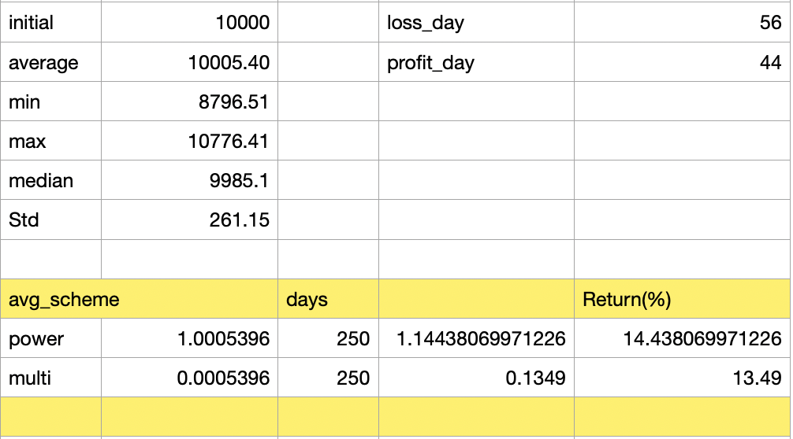
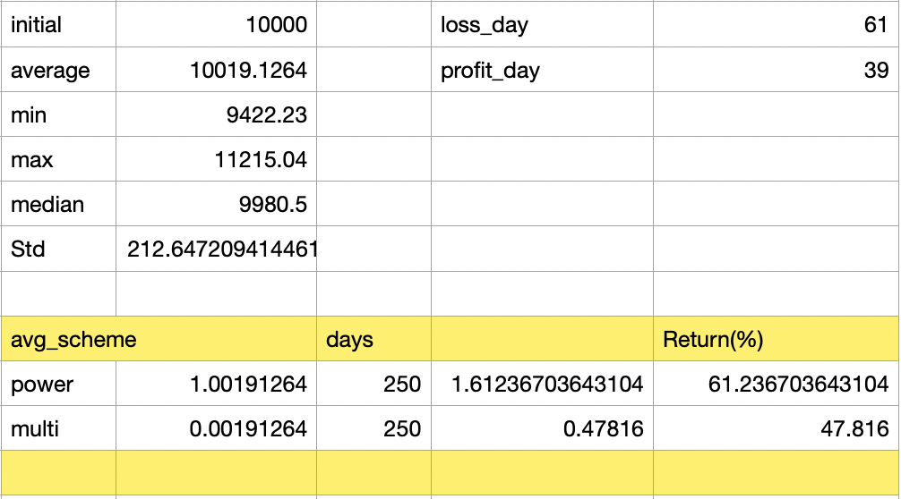

# LSTMRL_daytrade

This program is An LSTM Actor-Critic agent is trained to do the stock day-trading task, aiming at making 1% profit a day (60 trades/day using 5mins interval).

Freatures fed into the agent as State in MDP are pnormalized value of price, volume and some features made from Ichimoku method.

The agent is train for 13,000 games and can improve its policy (see, Fig.1 rewad-game graph in Training phase results).

The trained agent is test on test data, and can make around 15% profit on average (see, Fig.2 Test phase results).

- actiually there are 2 test scheme (1 and 2) the test scheme 1 yield is 15% with around 56% loss days and the test scheme 2 yield is 61% with around 61% loss days 

However, my current data size (aroud 2-3 months) is very small, pleas feel free to try on the larger data.

Also you can contact me at kupc25648@hotmail.com | kupc25648@gmail.com

# File descriptions
# Training phase file (00_train)

ichimoku.py  : File for creating Ichimoku cloud and some data cleansing  which will be turned into State data 

stock_ENV.py : Evironment for RL agent to be trained: state action reward are made here.

stock_GEN.py : Class that allows agent to do long-short trade

stock_RL.py  : RL Agent

stock_master.py  : Main file 

# Test phase file (01_test)

Filenames are the same but some parameters and rule of cutting loss are changed and implemented.

# Data

Datafile can be found here:
https://drive.google.com/file/d/1usrowrJPMkVNs-dV11mx8Z6LffEsx444/view?usp=sharing

# Training phase results

# Test phase results

Test result scheme 1

Test result scheme 2

